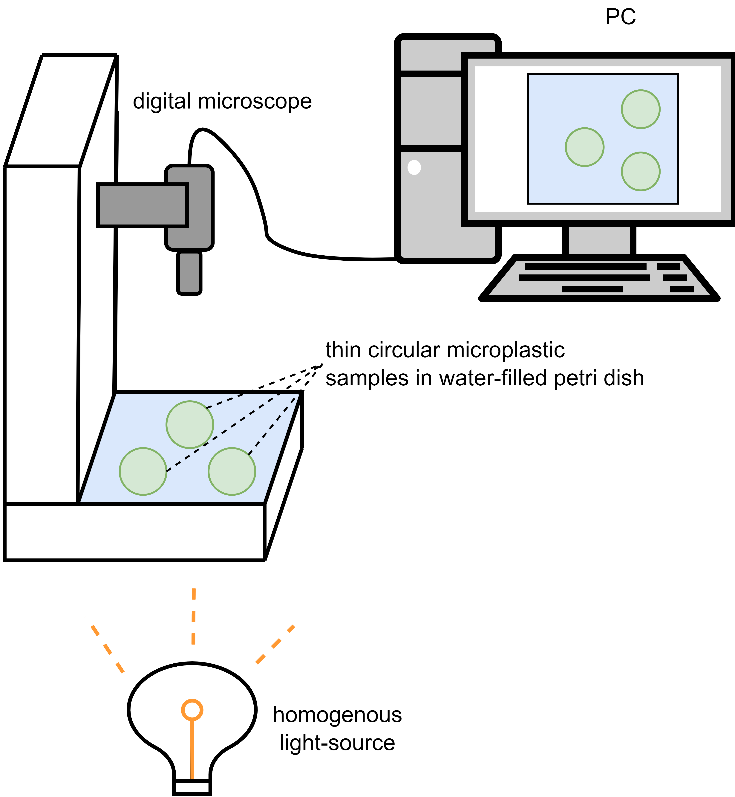
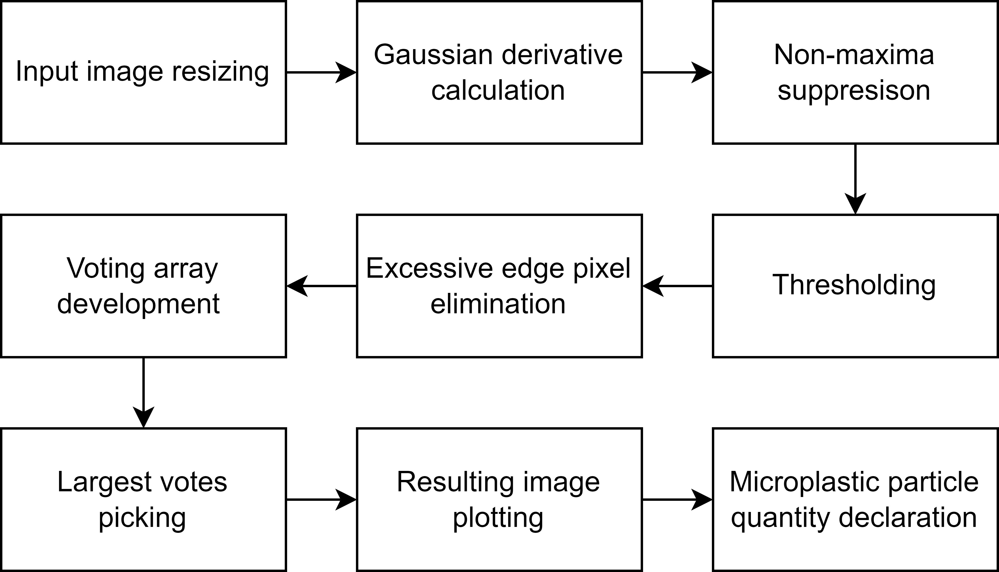

# Thin circular microplastic disk detection 

This project implements a custom Hough Transform to detect thin circular microplastic particles in digital microscope images.
The experimental setup consists of translucent microplastic disks placed in a water-filled petri dish. 
A USB-connected digital microscope captures top-view images of the samples, illuminated from below by a homogeneous light source.
In this experiment, the microplastic disks have a diameter of approximately 5 mm.
The experimental setup is shown at       


## 🔍 Overview



The system operates by:

1. **Input image resizing** using cv2.resize(), to reduce computational load
2. **Gaussian derivative calculation** using DoG filters, to extract image gradients
3. **Non-maxima Suppression** on non-edge pixels in gradient directions, to sharpen edges
4. **Thresholding** by setting a certain value, to filter out weak edges
5. **Excessive edge pixel elimination** for clusteresd edge points 
6. **Voting array development** to store possible circle center and radius coordinates
7. **Largest votes picking** of n-candidates
8. **Resulting image plotting** with matplotlib.pyplot.imshow()
9. **Microplastic particle quantity declaration** using the print() function


## 📦 Files in This Repo

| File                              | Description                                                   |
|-----------------------------------|---------------------------------------------------------------|
| `Microplastic_Detection.py`       | Main script to run microplastic detection on the input image  |
| `input_image.png`                 | Sample image to be analyzed                                   |
| `experimental_setup.png`          | Materials and methods for this experiment                     |
| `requirements.txt`                | Python package dependencies                                   |
| `README.md`                       | This documentation                                            |
| `flowchart.png`                   | Flowchart image of this project                               |


## 🚀 Usage
Run the diagnosis script:

```bash
python Microplastic_Detection.py
```